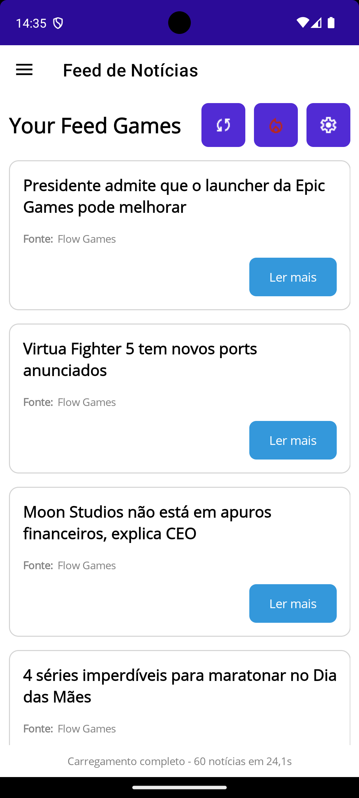
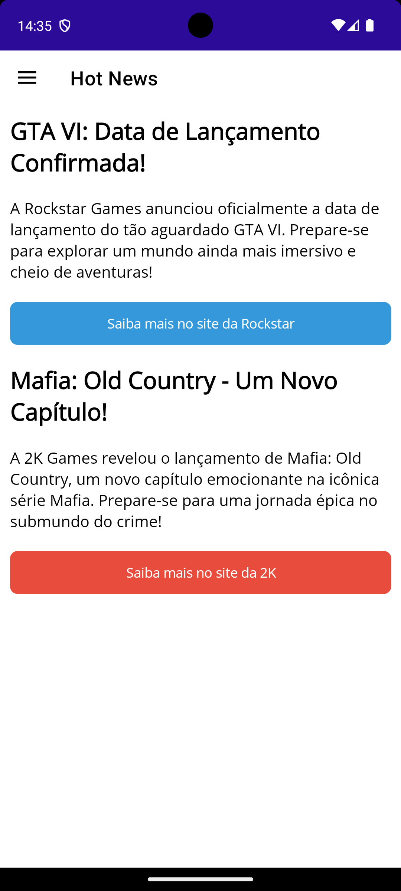
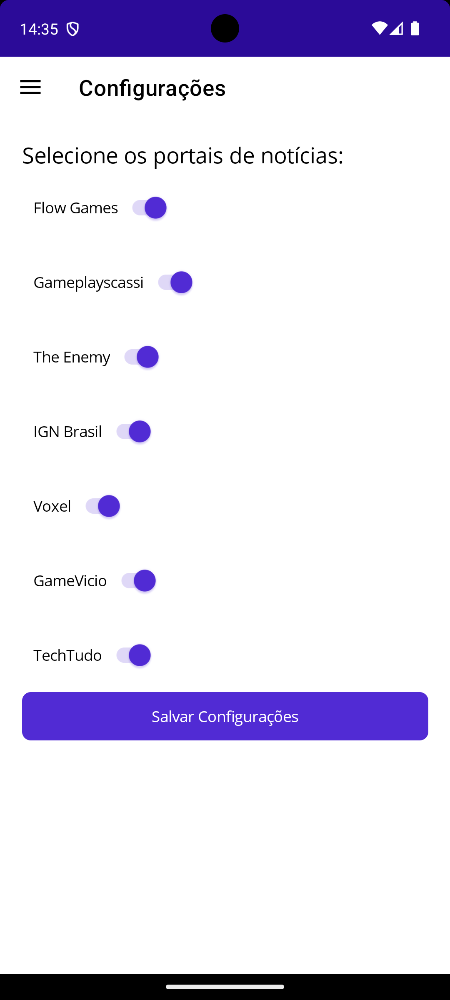

## Your Feed Games Logo ##

📱 Sobre o Aplicativo
Your Feed Games é um aplicativo multiplataforma desenvolvido com .NET MAUI 9.0 que centraliza as principais notícias do mundo dos games dos maiores portais brasileiros em um único lugar. Mantenha-se atualizado com as novidades do universo gamer de forma rápida e personalizável.

🛠️ Tecnologias Utilizadas
- .NET MAUI 9.0
- XAML para UI
- Lotties Files
- OneSignal (Notifications)

✨ Funcionalidades Principais
- Feed de Notícias Personalizável: Escolha de quais portais deseja receber as notícias.
- Atualização Rápida: Botão de recarregar para buscar as últimas notícias em tempo real.
- Hot News: Acesse as notícias mais quentes e populares do momento no mundo gamer.
- Multiplataforma: Funciona em iOS, Android, Windows e macOS.
- Configurações Flexíveis: Controle quais fontes de notícias deseja acompanhar.

🎮 Portais Suportados (Exemplos)
- Flow Games
- IGN Brasil
- GameVicio
- TechTudo
- The Enemy
- Voxel
- GamePlaysCassi
- Adrenaline
- Arkade
- Combo Infinito

⚙️ Configuração
- Acesse o botão de configurações ⚙️
- Marque/desmarque os portais que deseja receber notícias
- Salve as preferências
- Aproveite seu feed personalizado!

🔄 Como Atualizar
Toque no botão de atualização 🔄 na barra de ferramentas

🔥 Hot News
Toque no botão de "Hot News" para ver as notícias mais populares e quentes do momento, classificadas por relevância no mundo gamer.

📸 Screenshots

  
  
  

🤝 Contribuição
Contribuições são bem-vindas! Sinta-se à vontade para abrir issues ou pull requests.

📄 Licença
MIT License (adicione o arquivo de licença se aplicável)